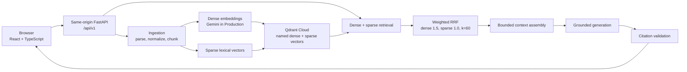

# Hybrid Search RAG

[](https://github.com/ayushxt25/Hybrid-Search-Rag/actions/workflows/ci.yml)


A production-oriented Retrieval-Augmented Generation application for ingesting internal documents, combining dense and sparse retrieval, and generating citation-backed answers over retrieved evidence.

Hybrid Search RAG is built as a full-stack engineering portfolio project: a React developer console, a FastAPI backend, Qdrant-backed hybrid search, provider-configurable embeddings and generation, API-key authentication, health checks, request observability, and automated backend/frontend validation.

- Live application: [hybrid-search-studio-three.vercel.app](https://hybrid-search-studio-three.vercel.app)
- Repository: [github.com/ayushxt25/Hybrid-Search-Rag](https://github.com/ayushxt25/Hybrid-Search-Rag)

## Live Demo

The current Production deployment is hosted on Vercel and uses same-origin API routing under `/api/v1`.

| View | Link |
| --- | --- |
| Application | [Open app](https://hybrid-search-studio-three.vercel.app) |
| Documents | [Manage documents](https://hybrid-search-studio-three.vercel.app/documents) |
| Retrieval Playground | [Test retrieval](https://hybrid-search-studio-three.vercel.app/retrieval) |
| Grounded Answers | [Ask grounded questions](https://hybrid-search-studio-three.vercel.app/answers) |
| System Health | [Inspect health](https://hybrid-search-studio-three.vercel.app/system) |

Production uses Gemini embeddings and Qdrant Cloud. Protected API operations require an authorized session API key; the frontend never embeds that key. When a user enters a key in System Health, it is stored only in browser `sessionStorage` for the active tab/session and is sent as the `X-API-Key` header.

Public visitors can inspect the interface and health experience. Document upload, retrieval, grounded-answer, and deletion workflows require authorized demo credentials.

### Demo Workflow

1. Open [System Health](https://hybrid-search-studio-three.vercel.app/system) and save a session API key.
2. Upload a TXT, Markdown, PDF, or DOCX document.
3. Test dense, sparse, or hybrid retrieval.
4. Ask a grounded question over the uploaded document.
5. Inspect citation metadata and source evidence.
6. Delete the temporary document.

## Why This Project Exists

Internal-document search has several practical failure modes. Keyword search can miss semantic matches, vector-only retrieval can miss exact terminology, and generated answers need traceable evidence rather than unsupported prose. A useful RAG application also needs document lifecycle management, metadata filtering, authentication, health checks, and operational diagnostics.

This project implements those pieces together so the retrieval path, grounding path, frontend workflow, and deployment constraints can be evaluated as one system.

## Key Features

### Document Ingestion and Lifecycle

- TXT, Markdown, PDF, and DOCX ingestion.
- Text normalization and deterministic word-based chunking.
- Deterministic document and chunk identifiers from normalized content.
- Document listing, metadata detail, replacement, and deletion.
- Upload validation by extension, content, and configured size limit.

### Hybrid Retrieval

- Dense semantic retrieval through the configured embedding provider.
- Sparse lexical retrieval through a deterministic hashed lexical provider.
- Application-side weighted Reciprocal Rank Fusion.
- Document ID and content-type filters.
- Configurable candidate/result limits.
- Optional score diagnostics with branch ranks, raw branch scores, RRF contributions, fused rank, and fused score.

### Grounded Answers

- Hybrid retrieval followed by bounded context assembly.
- Prompt construction that treats retrieved text as evidence, not instructions.
- Citation marker validation against available sources.
- Insufficient-context responses when evidence is missing or inadequate.
- Provider abstraction with deterministic and OpenAI-compatible generation providers.

### Production and Security

- API-key authentication with SHA-256 digest verification.
- Session-only frontend API key handling in `sessionStorage`.
- Trusted-host validation and disabled-by-default CORS.
- Same-origin Vercel deployment for frontend and API.
- Request IDs on API responses.
- Structured allowlisted observability logs.
- Liveness and readiness endpoints.
- Sanitized third-party HTTP transport logging.
- In-memory grounded-answer rate limiting.

### Developer Experience

- Docker Compose local stack with API, frontend, and Qdrant.
- GitHub Actions CI for backend quality/tests and container build validation.
- Backend tests with pytest and Ruff.
- Frontend tests with Vitest, React Testing Library, ESLint, TypeScript, and Vite build validation.
- Vercel dependency and bundle audit script for the serverless Python function.

## Architecture



The same backend supports different dense embedding providers:

| Environment | Dense provider | Model | Dimension |
| --- | --- | --- | --- |
| Local/Docker | Sentence Transformers | `sentence-transformers/all-MiniLM-L6-v2` | 384 |
| Vercel Production | Gemini | `gemini-embedding-001` | 768 |

Qdrant collections must match the configured embedding provider. A collection created for 384-dimensional local vectors is not compatible with the 768-dimensional Production Gemini configuration, and vice versa.

## Retrieval Design

Dense retrieval embeds the query and searches the named dense vector in Qdrant. Sparse retrieval encodes the query into a deterministic lexical sparse vector and searches the named sparse vector. Hybrid retrieval runs both branches, then fuses the branch rankings in application code.

The current fusion defaults are:

- Dense weight: `1.5`
- Sparse weight: `1.0`
- RRF constant `k`: `60`

The fused score is a ranking signal, not a probability or confidence score. Diagnostics expose how dense and sparse branches contributed to the final rank while avoiding vectors, raw provider payloads, prompts, and secrets.

## Grounding and Citation Safety

The grounded-answer pipeline is deliberately staged:

1. Retrieve candidate chunks with hybrid search.
2. Assemble a bounded context package with stable source numbers.
3. Build prompts that require answers to use supplied evidence.
4. Generate with the configured provider.
5. Validate emitted `[Source N]` markers against available sources.
6. Return insufficient context instead of fabricating citations when evidence is inadequate.

Broad questions, weakly supported questions, or questions outside the indexed documents may intentionally return an insufficient-context response. The project reduces unsupported answers through retrieval scoping, citation validation, and conservative refusal behavior; it does not claim to eliminate hallucinations.

## Technology Stack

| Layer | Technologies |
| --- | --- |
| Frontend | React 18, TypeScript 5.7, Vite 6, Tailwind CSS, React Router, TanStack Query, Lucide React |
| Backend API | Python 3.11-3.12, FastAPI, Pydantic Settings, Uvicorn |
| Retrieval | Qdrant, Gemini embeddings, Sentence Transformers, deterministic hashed lexical sparse vectors |
| Document parsing | `pypdf`, `python-docx`, built-in text/Markdown loading |
| Generation | Deterministic acceptance provider, OpenAI-compatible provider abstraction |
| Testing and quality | pytest, Ruff, Vitest, React Testing Library, ESLint, TypeScript |
| Infrastructure | Docker, Docker Compose, GitHub Actions, Vercel, Qdrant Cloud |

## Repository Structure

```text
backend/                 FastAPI application, retrieval, ingestion, generation, tests
frontend/                React/Vite application and frontend tests
api/                     Vercel FastAPI entrypoint and SPA serving hook
scripts/                 Acceptance, smoke, Vercel static, and bundle-audit scripts
deployment/vercel/       Vercel deployment notes for the accepted architecture
datasets/                Sample documents and retrieval evaluation fixtures
.github/workflows/       GitHub Actions CI workflow
Dockerfile               Local/container backend image
docker-compose.yml       Local API, frontend, and Qdrant stack
vercel.json              Full-stack Vercel routing/build configuration
pyproject.toml           Backend package, optional extras, pytest, and Ruff config
```

## API Overview

All API routes are served under `/api/v1`. When API authentication is enabled, protected routes require:

```http
X-API-Key: <your-session-api-key>
```

| Method | Route | Purpose | Auth |
| --- | --- | --- | --- |
| `GET` | `/api/v1/health` | Basic service metadata | Public |
| `GET` | `/api/v1/health/live` | Fast process liveness check | Public |
| `GET` | `/api/v1/health/ready` | Dependency/config readiness check | Public |
| `GET` | `/api/v1/documents` | List indexed documents | Required when search protection is enabled |
| `GET` | `/api/v1/documents/{document_id}` | Fetch indexed document metadata | Required when search protection is enabled |
| `POST` | `/api/v1/documents/ingest` | Upload and index a document | Required |
| `DELETE` | `/api/v1/documents/{document_id}` | Delete all chunks for a document | Required |
| `POST` | `/api/v1/search/dense` | Dense semantic retrieval | Required when search protection is enabled |
| `POST` | `/api/v1/search/sparse` | Sparse lexical retrieval | Required when search protection is enabled |
| `POST` | `/api/v1/search/hybrid` | Weighted hybrid retrieval | Required when search protection is enabled |
| `POST` | `/api/v1/answers/grounded` | Generate a cited grounded answer | Required |

Search and answer request bodies support `document_id`, `document_ids`, `content_types`, `limit`, and, for hybrid/answers, `candidate_limit`. Search routes can also request `include_score_diagnostics`.

## Local Development

Python is pinned to `>=3.11,<3.13` in `pyproject.toml`. The frontend does not declare a Node engine; use a current Node.js LTS release with npm.

### Windows PowerShell

```powershell
git clone https://github.com/ayushxt25/Hybrid-Search-Rag.git
cd Hybrid-Search-Rag

python -m venv .venv
.\.venv\Scripts\Activate.ps1
python -m pip install --upgrade pip
python -m pip install -e ".[dev]"

Copy-Item .env.example .env
docker compose up -d qdrant

python -m uvicorn app.main:app --app-dir backend --reload --host 127.0.0.1 --port 8000
```

In a second terminal:

```powershell
cd frontend
npm ci
Copy-Item .env.example .env
npm run dev
```

### macOS/Linux Shell

```bash
git clone https://github.com/ayushxt25/Hybrid-Search-Rag.git
cd Hybrid-Search-Rag

python -m venv .venv
source .venv/bin/activate
python -m pip install --upgrade pip
python -m pip install -e ".[dev]"

cp .env.example .env
docker compose up -d qdrant

python -m uvicorn app.main:app --app-dir backend --reload --host 127.0.0.1 --port 8000
```

In a second terminal:

```bash
cd frontend
npm ci
cp .env.example .env
npm run dev
```

For a production-style local stack with the React build served by Nginx and `/api/` proxied to FastAPI:

```bash
docker compose up -d --build
python scripts/fullstack_smoke.py
```

The local Docker frontend is available at `http://localhost:3000`; the API is available at `http://localhost:8000`.

## Environment Configuration

Use `.env.example` as the local template and a deployment secret manager for shared environments. Do not commit `.env` files.

### Required Integration Secrets

- `QDRANT_URL`
- `QDRANT_API_KEY`
- `GEMINI_API_KEY` when `DENSE_EMBEDDING_PROVIDER=gemini`
- `API_AUTH_KEY_SHA256` when `API_AUTH_ENABLED=true`
- `OPENAI_API_KEY` when `GENERATION_PROVIDER=openai`

`API_AUTH_KEY_SHA256` stores a SHA-256 digest. Clients send the matching plaintext key only in the `X-API-Key` request header.

### Application Configuration

- Runtime and logging: `ENVIRONMENT`, `LOG_LEVEL`, `OBSERVABILITY_ENABLED`
- API/auth: `API_V1_PREFIX`, `API_AUTH_ENABLED`, `API_AUTH_HEADER_NAME`, `API_AUTH_PROTECT_SEARCH`
- Security boundaries: `TRUSTED_HOSTS`, `CORS_ENABLED`, `CORS_ALLOWED_ORIGINS`, `CORS_ALLOW_CREDENTIALS`
- Upload limits: `MAX_JSON_REQUEST_BYTES`, `MAX_DOCUMENT_UPLOAD_BYTES`, `VITE_MAX_DOCUMENT_UPLOAD_BYTES`
- Qdrant: `QDRANT_HYBRID_COLLECTION_NAME`, `QDRANT_HEALTH_TIMEOUT_SECONDS`
- Embeddings: `DENSE_EMBEDDING_PROVIDER`, `DENSE_EMBEDDING_DIMENSIONS`, `GEMINI_EMBEDDING_MODEL`, `GEMINI_EMBEDDING_DIMENSION`, `GEMINI_EMBEDDING_TIMEOUT_SECONDS`
- Retrieval: `HYBRID_DENSE_WEIGHT`, `HYBRID_SPARSE_WEIGHT`, `HYBRID_RRF_K`
- Grounded answers: `CONTEXT_MAX_CHARACTERS`, `CONTEXT_MAX_SOURCES`, `GENERATION_PROVIDER`, `GENERATION_REQUIRE_ANSWER_CITATIONS`

Secrets must never use `VITE_` prefixes. Vite variables are public build-time values embedded into the browser bundle. The frontend never receives Qdrant, Gemini, OpenAI, or API-auth digest values.

## Testing and Quality

### Backend

```bash
python -m ruff format --check backend
python -m ruff check backend
python -m pytest
```

Latest verified backend run in this workspace: `738 passed, 1 skipped`.

### Frontend

```bash
cd frontend
npm run lint
npm run typecheck
npm run test:run
npm run build
```

Latest verified frontend test run in this workspace: `79 passed`.

### Deployment Checks

```bash
python scripts/vercel_bundle_audit.py
vercel build
docker compose config
docker build --tag hybrid-search-rag-ci:local .
```

## Continuous Integration

GitHub Actions runs on pushes to `main`, pull requests targeting `main`, and manual dispatch. The `quality-and-tests` job installs the full backend test dependency set with `python -m pip install -e ".[test]"`, then runs:

```bash
python -m ruff format --check backend
python -m ruff check backend
python -m pytest
```

The `container-build` job validates Compose configuration and builds the backend image:

```bash
docker compose config
docker build --tag hybrid-search-rag-ci:local .
```

The latest observed CI run for `main` completed with `quality-and-tests` and `container-build` passing.

## Deployment

Production is a single Vercel project:

- React SPA built from `frontend/`.
- FastAPI entrypoint at `api/index.py`.
- Same-origin API calls to `/api/v1`.
- Vercel rewrites route `/api/v1/:path*` to FastAPI and SPA routes to `index.html`.
- Gemini remote embeddings keep the serverless function bundle below practical limits.
- Qdrant Cloud stores dense and sparse vectors.
- Production secrets are configured in Vercel, not committed to Git.

The stable Production alias is:

```text
https://hybrid-search-studio-three.vercel.app
```

Production environment changes require a new deployment to take effect. Qdrant collection schema must match the configured embedding provider dimensions and named-vector layout.

For the Vercel-specific deployment notes, see [deployment/vercel/DEPLOYMENT.md](deployment/vercel/DEPLOYMENT.md).

## Security and Operational Design

Production-oriented safeguards implemented in this project include:

- SHA-256 API-key digest verification with constant-time comparison.
- Frontend session key storage only in browser `sessionStorage`.
- No server secrets or API-auth digest in frontend configuration.
- Trusted-host validation and disabled-by-default CORS.
- Same-origin Production deployment.
- Upload-size enforcement in backend and frontend configuration.
- Request IDs attached to API responses and structured logs.
- Health endpoints split into liveness and readiness.
- Allowlisted JSON log fields.
- Third-party HTTP transport logs raised to `WARNING` to avoid URL leakage.
- Sanitized error responses for provider, vector-store, validation, and upload failures.
- Citation marker validation and insufficient-context behavior.

These controls are scoped to this project. The app does not implement user accounts, OAuth, tenant isolation, or long-term audit storage.

## Engineering Decisions and Trade-Offs

- **Dense plus sparse retrieval:** Dense search handles semantic matches; sparse search preserves exact terminology and identifiers.
- **Application-side weighted RRF:** Fusion stays transparent, testable, and independent of Qdrant server-side fusion behavior.
- **Separate embedding providers:** Local Docker can use Sentence Transformers, while Vercel uses Gemini to avoid shipping heavy ML dependencies in a serverless bundle.
- **Deterministic identifiers:** Document and chunk IDs are derived from normalized content, enabling idempotent ingestion and predictable cleanup.
- **Conservative grounded answers:** The answer service validates citation markers and returns insufficient context when evidence is inadequate.
- **Session-scoped frontend key:** The browser can authenticate demo workflows without embedding credentials in source, build output, or persistent local storage.

## Current Limitations

- The public demo requires authorized credentials for protected document and answer workflows.
- The deterministic generation provider is intentionally conservative and best suited to acceptance/demo flows.
- Serverless function constraints influence the Production embedding provider and dependency set.
- Document parsing depends on extractable text; scanned image-only PDFs are not OCR processed.
- Rate limiting and document replacement locks are process-local.
- There is no multi-user account system or long-term chat history.

## Roadmap

- Add retrieval-quality evaluation reports with reproducible benchmark datasets.
- Add reranking for final candidate ordering.
- Support streaming grounded answers.
- Improve PDF parsing with optional OCR for scanned documents.
- Add per-user workspaces and document isolation.
- Add automated Production smoke tests that avoid persistent test data.

## Author

Ayush Kumar Giri

- GitHub: [ayushxt25](https://github.com/ayushxt25)
- LinkedIn: [ayush-giri-04544a348](https://linkedin.com/in/ayush-giri-04544a348)
